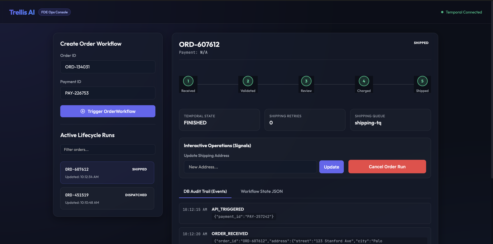
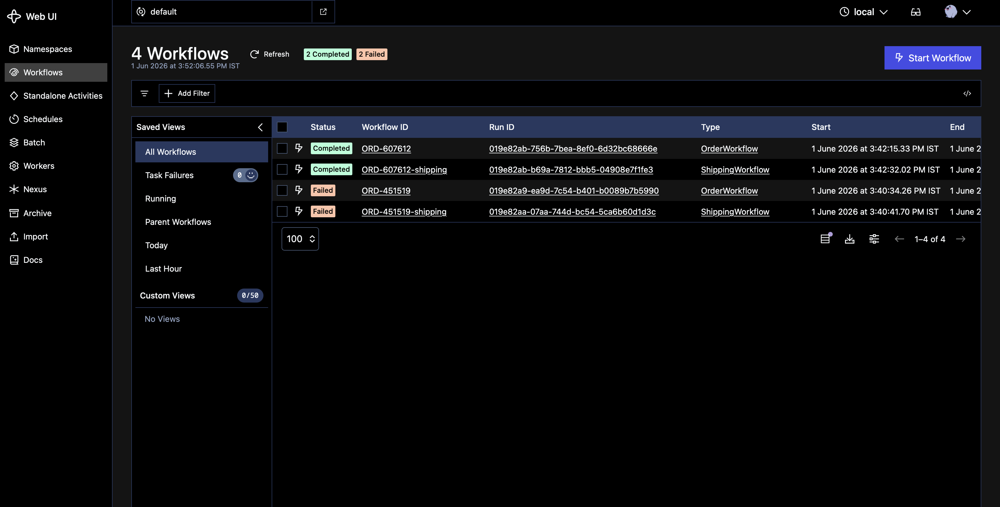

# Trellis Eng Takehome - Order Lifecycle Orchestrator

Prior authorization workflows fail silently — retries cause duplicate submissions, low-confidence extractions slip through without review, and there's no audit trail for compliance. This system solves all three.

---

## 1. How This Fits Trellis
This orchestrator simulates the exact control plane required to automate pre-service paperwork at scale. In production, Trellis ingests unstructured faxes/clinical charts, extracts intent, validates clinical criteria against medical policies, and writes approval decisions back to the provider's EHR. By orchestrating these asynchronous operations through Temporal and SQL, we ensure that API failures during EHR writes or insurance portal updates are handled safely, with automatic retries and complete operational visibility.

---

## 2. Architectural Decisions & Healthcare Mapping

To align with how Trellis operates, I mapped the required order lifecycle primitives to real-world healthcare workflows:

*   **Intake (`ReceiveOrder` & `ValidateOrder`)**: Models patient document intake and automated checks against insurer guidelines.
*   **Idempotent Submission (`ChargePayment`)**: Models submitting the auth to an insurance portal. Uses a SQL unique constraint (`payment_id`) to ensure that retries (due to timeout or network drops) never trigger duplicate submissions.
*   **Isolated Sync (`ShippingWorkflow`)**: Runs on its own task queue (`shipping-tq`) to demonstrate queue isolation, ensuring downstream EHR sync bottlenecks do not block incoming ingestion.

---

## 3. High-Leverage Features Implemented

### Dynamic Confidence Score Routing (Straight-Through Processing)
*   **Scenario**: When a clinical document is parsed, the AI extraction assigns a confidence score (simulated from 65% to 100%).
*   **Behavior**: 
    *   **Auto-Approve ($\ge$ 90%)**: High-confidence extractions bypass the manual queue entirely and trigger the charge/shipping workflows immediately. A 90% threshold mirrors common straight-through processing thresholds used in revenue cycle management.
    *   **Review Queue (< 90%)**: Low-confidence cases are routed to the `PENDING_MANUAL_REVIEW` step, suspending the workflow for up to 8 seconds for human clinician overrides.

### Clinical human-in-the-loop Review Console
*   Exposes a real-time console at `http://localhost:8000` showing active workflow states and retry counters.
*   Provides action triggers to **Approve**, **Reject**, or **Signal Address Updates** to the in-flight workflow.

### Non-repudiation Audit Trail
*   Every state transition, activity failure, retry, and manual override is recorded in an immutable `events` table in the local SQL database, providing a compliance timeline.

```
       +------------------------------------+
       |  FastAPI Console / HTTP Server     |
       +-----------------+------------------+
                         |
                         v (Signals & Queries)
       +-----------------+------------------+
       |       Temporal Client / SDK        |
       +-----------------+------------------+
                         |
                         v (Task Dispatches)
      /==================+===================\
     /                                        \
    v (Queue: "default")                       v (Queue: "shipping-tq")
+---+----------------+                     +---+-------------------+
|  OrderWorkflow     |                     |  ShippingWorkflow     |
|  - ReceiveOrder    |                     |  - PreparePackage     |
|  - ValidateOrder   |                     |  - DispatchCarrier    |
|  - ChargePayment   |                     |  - ShipOrder          |
+---+----------------+                     +---+-------------------+
    |                                          |
    +--------------------+---------------------+
                         | (SQL Reads/Writes)
                         v
                +--------+--------+
                |   SQLite DB     |
                +-----------------+
```

---

## 4. Console & Workflow Visualizations

Below are screenshots showing the operational consoles in action during local workflow execution:

### Human-in-the-Loop Ops Console Dashboard
Exposes order metadata, active Temporal state steps, AI extraction confidence scores, and manual signal actions:


### Temporal Web UI Workflows List
Displays task queue isolation of parent `OrderWorkflow` and child `ShippingWorkflow` runs:


---

## 5. Production Considerations

### SQLite with Thread Pools
*   **Why**: SQLite was chosen for portability; production deployments would use PostgreSQL with a connection pool.
*   **Concurrency**: Built-in blocking `sqlite3` calls are wrapped in `asyncio.to_thread` to prevent event-loop blockages. 

### Parent-Child Workflow Synchronization (Race Conditions)
*   If the child `ShippingWorkflow` carrier dispatch activity fails, it signals `DispatchFailed` back to the parent and exits.
*   **Production Note**: Because Temporal signals are asynchronous, a parent catching a `ChildWorkflowError` might read the error *before* the signal buffer flushes. To handle this cleanly in production, the child workflow returns a status dict (`{"status": "failed", "reason": "dispatch_failed"}`) instead of raising a raw exception, allowing deterministic branch evaluation.

---

## 6. Local Setup & Verification

### Prerequisites
Make sure the Temporal local server is running.

**Via Temporal CLI:**
```bash
brew install temporal
temporal server start-dev
```

**Via Docker:**
```bash
docker run --rm -d --name temporal -p 7233:7233 -p 8233:8233 temporalio/auto-setup:1.22.0
```

### Installation & Execution
1. Install dependencies:
   ```bash
   pip install temporalio fastapi uvicorn aiosqlite pytest
   ```
2. Start the workers (runs both the default and shipping queues):
   ```bash
   python3 worker.py
   ```
3. Start the FastAPI application:
   ```bash
   uvicorn app:app --reload --port 8000
   ```
4. Open the Ops Dashboard:
   Go to `http://127.0.0.1:8000` to trigger workflows, send signals, and inspect the real-time database audit log.

### Running Tests
The mock-based test suite validates the workflows and database idempotency instantly:
```bash
PYTHONPATH=. pytest tests/test_workflows.py
```
